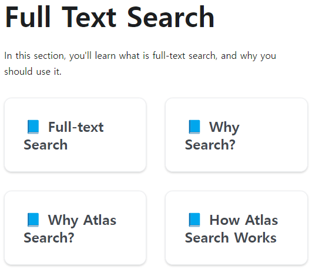

# Live Demo Case 1

## Goal

- Remove redundant [document emojis](http://localhost:3000/mongodb-search-lab/docs/category/full-text-search) since you already have custom [navigation bar icons](http://localhost:3000/mongodb-search-lab/docs/intro#-navigation-bar-icons).
- Prevent title truncation and display the full title.
- Simplify the display by showing only the title and removing the description.

Start by swizzling `DocCard` in `@docusaurus/theme-classic`.

| BEFORE | AFTER |
| - | - |
|  |  |
