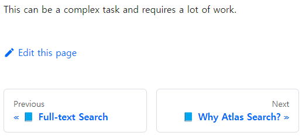
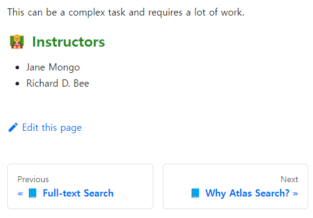

# Live Demo Case 2

## Goal

- Add a Docusaurus admonition at the bottom of each document.
  - Include a bold message: "Check out the MongoDB Community!"
  - Provide a link: <https://www.mongodb.com/community/forums/>
- Place the admonition under the document footer.

Start by swizzling `DocItem/Footer` in `@docusaurus/theme-classic`.

| BEFORE | AFTER |
| - | - |
|  |  |
